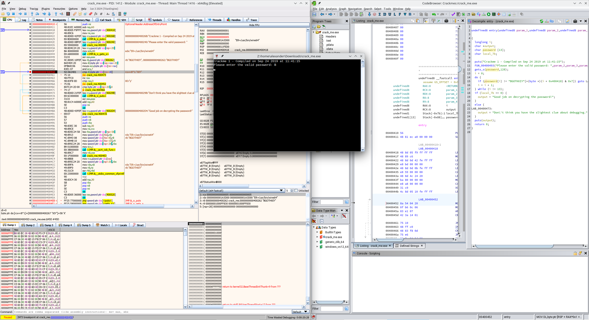
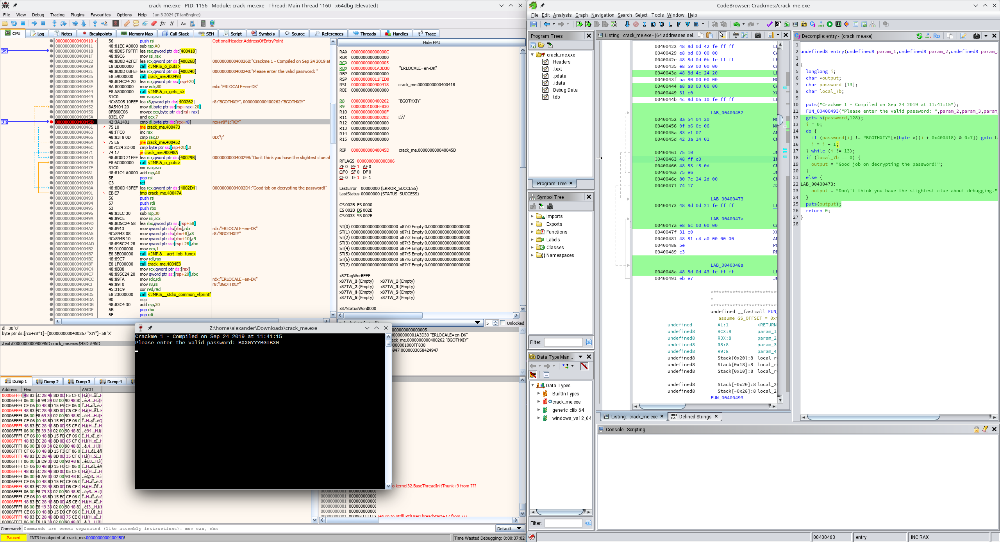

```
file crack_me.exe 
crack_me.exe: PE32+ executable (console) x86-64, for MS Windows, 3 sections
```

Flag: `BXXGYYYBGIBXX`

* Run `strings`
```
$ strings crack_me.exe | grep -v \\.
Richk
@Please enter the valid password: 
BGOTHXIY
Crackme 1 - Compiled on Sep 24 2019 at 11:41:15
Good job on decrypting the password!
VWSH
\$XH
\$ H
0[_^
puts
gets_s
__acrt_iob_func
__stdio_common_vfprintf
```
* `BGOTHXIY` is not the password
* Decompile binary with Ghidra:
```c
  gets_s(password,128);
  i = 0;
  do {
    if (password[i] != "BGOTHXIY"[*(byte *)(i + 0x400418) & 0x7]) goto LAB_00400473;
    i = i + 1;
  } while (i != 13);
  if (local_7b == 0) {
    output = "Good job on decrypting the password!";
  }
  else {
LAB_00400473:
    output = "Don\'t think you have the slightest clue about debugging.";
  }
  puts(output);
```
* The array indices somehow involve the hex values at address `0x400418` and following:
```
        00400418 48 8d 05 f9 ff ff ff              LEA        RAX,[LAB_00400418]
        0040041f 48 89 c6                          MOV        RSI,RAX
        00400422 48 8d 0d 42 fe ff ff              LEA        param_1,[s_Crackme_1_-_Compiled_on_Sep_24_2_00   = "Crackme 1 - Compiled on Sep 2
```
* A keygen would need to have the same hex code at the same offset, so this does not seem like a practical solution
* Extracting the password using a debugger is easier than reverse-engineering it
* Open binary in x64dbg
* Go to address 000000000040045D using <kbd>Ctrl</kbd>+<kbd>G</kbd>
* This is the `CMP` instruction to compare the user input with the valid password char by char
* Set a breakpoint
* `RUN`: Run program
* Check section below x64dbg listing for the value of `dl`
* Note first char of password
* Restart program
* Repeatedly click on `Run` until we reach the next comparison at the breakpoint
* Note next char of password in `dl`
* Goto `RUN`
* Decrypted password is `BXXGYYYBGIBXX`



