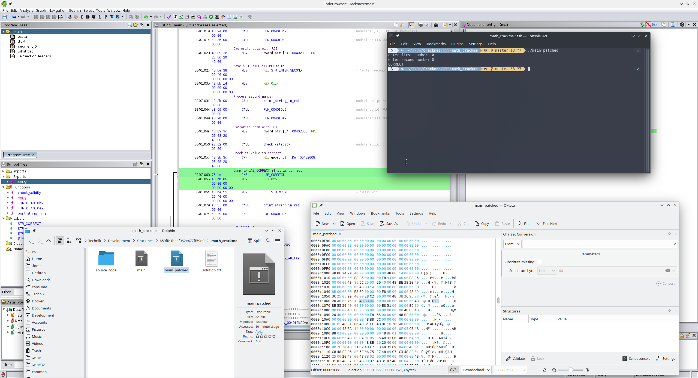

```
file main
main: ELF 64-bit LSB executable, x86-64, version 1 (SYSV), statically linked, stripped
```

* <kbd>Defined Strings</kbd> does not show anything useful
* `FUN_004010e9(void)` manipulates a string, which is stored in the data section


* The data labels be renamed via right click > <kbd>Edit label...</kbd>
* The strings can be properly shown by selecting the relevant addresses and right click > <kbd>Data</kbd> > <kbd>String</kbd>
* It appears that since the program was written in assembly, Ghidra can't decompile it completely and quite a few instructions are missing in the decompiled C code. Thus, one has to analyze the output of the disassembler manually
* The validity check itself consists of convoluted register arithmetic
* Instead, try to patch the binary:
    * Right click on JZ instruction after CMP > <kbd>Patch Instruction</kbd>
    * Change JZ to JNZ
    * Observe that the byte changes from 74 to 75
    * Using a hex editor is easier than Ghidra
    * Open binary in Okteta
    * Search for bytes of JZ instruction: 48bb06
    * Change `20 40 00 74 1E 48 BB 06 00 00 00 00 00 00 00 48` to `20 40 00 75 1E 48 BB 06 00 00 00 00 00 00 00 48`


The patched binary works as expected:
