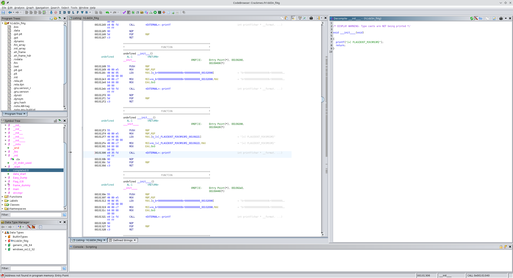

```
$ file h1dd3n_fl4g
h1dd3n_fl4g: ELF 64-bit LSB pie executable, x86-64, version 1 (SYSV), dynamically linked, interpreter /lib64/ld-linux-x86-64.so.2, BuildID[sha1]=d7fb24ce1889905a7da388dc99a99f0d3129e62a, for GNU/Linux 3.2.0, not stripped
```

Flag: `FLAG{B3ST_R3V3RS3R}`

```
$ strings h1dd3n_fl4g
[...]
r3v3rs3rH
lixachevH
[+] Ent3r L0g1n: 
[+] Ent3r p4$$w0rd: 
[!] D0 y0u th1nk 3v3ryth1ng 1s s0 s1mpl3?
[*] B4d L0g1n 0r P4$$w0rd, y0u b4d h4ck3r:(.
[...]
[+] FLAG{B3ST_R3V3RS3R}
[...]
```

```
$ ./h1dd3n_fl4g 
[+] Ent3r L0g1n: r3sr3v3r         
[+] Ent3r p4$$w0rd: vehcaxil
[*] B4d L0g1n 0r P4$$w0rd, y0u b4d h4ck3r:(.
$ ./h1dd3n_fl4g 
[+] Ent3r L0g1n: r3sr3v3r
[+] Ent3r p4$$w0rd: lixachev
[*] B4d L0g1n 0r P4$$w0rd, y0u b4d h4ck3r:(.
$ ./h1dd3n_fl4g 
[+] Ent3r L0g1n: r3v3rs3r
[+] Ent3r p4$$w0rd: vehcaxil
[*] B4d L0g1n 0r P4$$w0rd, y0u b4d h4ck3r:(.
$ ./h1dd3n_fl4g 
[+] Ent3r L0g1n: r3v3rs3r
[+] Ent3r p4$$w0rd: lixachev
[!] D0 y0u th1nk 3v3ryth1ng 1s s0 s1mpl3?
```

There doesn't seem to be a way to get the binary to print the flag, except maybe for a buffer overflow according to a comment on the crackme's page.

