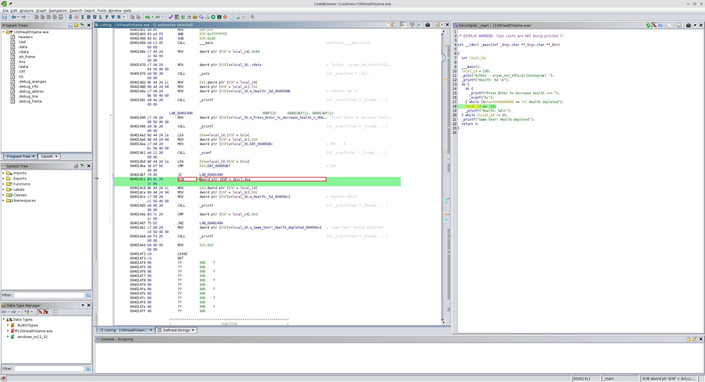
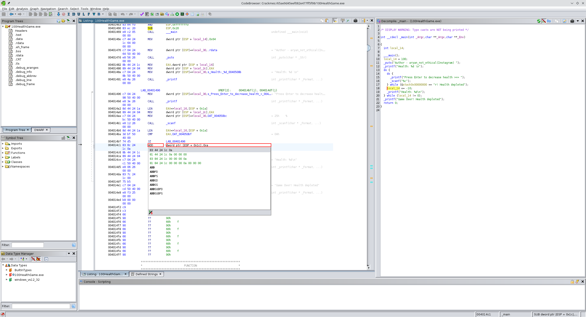
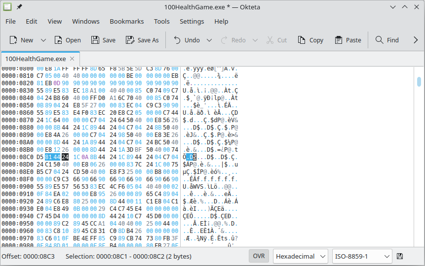
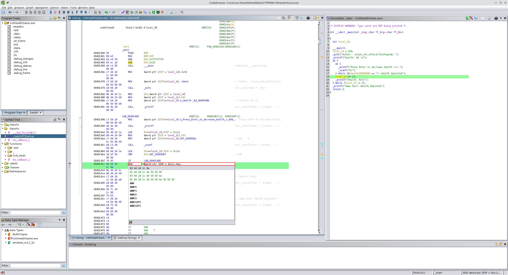
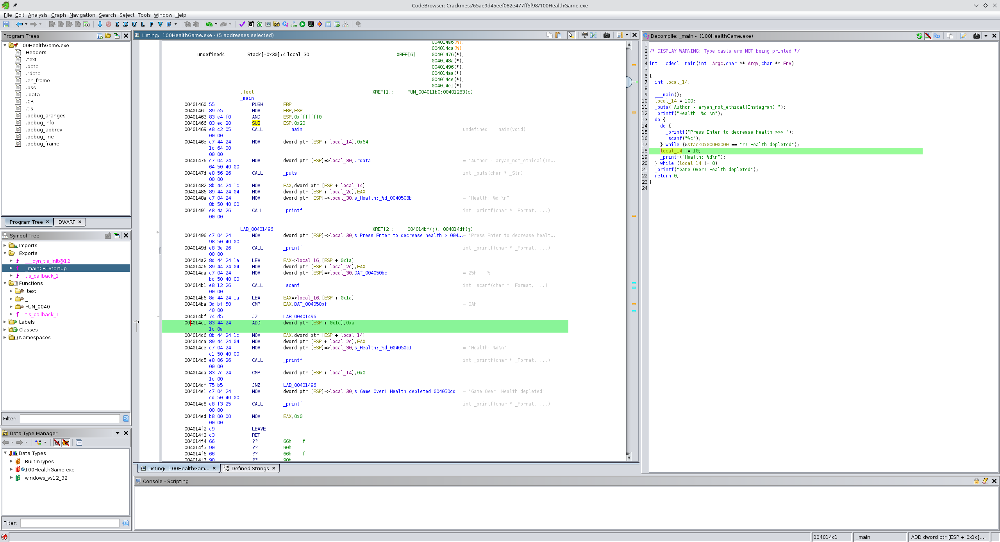

```
$ file 100HealthGame.exe 
100HealthGame.exe: PE32 executable (console) Intel 80386, for MS Windows, 13 sections
```

When one runs the binary, a health of 100 is displayed and each key press decreases it by 10. The goal is to patch the binary so the health increases by 10 each time instead.

```
$ wine 100HealthGame.exe
Author - aryan_not_ethical(Instagram)
Health: 100
Press Enter to decrease health >>>

Health: 90
Press Enter to decrease health >>>
Health: 80
Press Enter to decrease health >>>
```

The decompiled code
```c
local_14 += -10;
```

corresponds to the following section of the listing:
```
        004014c1 83 6c 24        SUB        dword ptr [ESP + local_14],0xa
                 1c 0a
```
* Now that we know what sequence of bytes needs to be patched, the required changes need to be determined
* Right-click > Patch Instruction

* Changing `SUB` to `ADD`:

	This results in the following bytes:
	```
			004014c1 81 44 24        ADD        dword ptr [ESP + 0x1c],0xa
					1c 0a 00 
					00 00
	```

* Patch the binary using Okteta:


* The first patch didn't work, resulting in the health jumping wildly. But when patching an instruction in Ghidra, one can apparently choose from multiple possible sequences of hex values and since the one chosen required more bytes than the original `SUB` instruction, the behaviour was not as intended.

	Choosing an option which takes up the same number of bytes resultes in a patched binary that worked as expected, counting up by 10 after each key press.

	

	```
			004014c1 83 44 24        ADD        dword ptr [ESP + 0x1c],0xa
					1c 0a
	```
	

	This achieved the desired effect:

	```
	$ wine 100HealthGame_patched.exe
	Author - aryan_not_ethical(Instagram)
	Health: 100
	Press Enter to decrease health >>>

	Health: 110
	Press Enter to decrease health >>>
	Health: 120
	Press Enter to decrease health >>>
	```