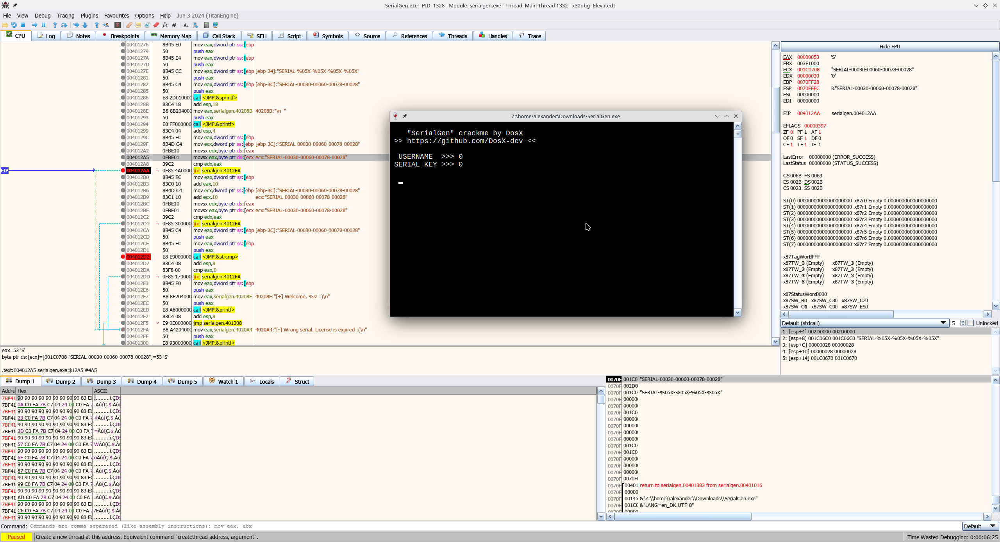

```
$ file SerialGen.exe
SerialGen.exe: PE32 executable (console) Intel 80386 (stripped to external PDB), for MS Windows, 2 sections
```

One flag discovered with x32dbg:
```

    "SerialGen" crackme by DosX
 >> https://github.com/DosX-dev <<

  USERNAME  >>> 0
 SERIAL KEY >>> SERIAL-00030-00060-00078-00028

  [+] Welcome, 0! :)
```
# Steps
* Mark `s__0040208b` as string in Listing view
* The return values of `return_32()` and `strcmp()` are assigned to the same variable. To make the code easier understand, I used the option <kbd>Split Out As New Variable</kbd>
* Copying and pasting the decompiled code didn't result in working username/serial combinations
* Therefore, analyze crackme at runtime
* Use x32dbg to execute crackme and set a breakpoint at address `0x004012AA`, where the comparison between the entered and expected serial occurs:

* A string `SERIAL-%05X-%05X-%05X-%05X` is created, which is then used as a `printf()` format string
* With this, a keygen can be created
* When the vars written to the serial are of type `char`, the username `1` results in a correct serial, but `9` already results in a non-working one:
    ```
    $ ./a.out 

        "SerialGen" crackme by DosX
    >> https://github.com/DosX-dev <<

    USERNAME  >>> 9
    SERIAL-00039-00072-FFFFFF8E-FFFFFFC5
    ```
    ```
    $ wine SerialGen.exe

            "SerialGen" crackme by DosX
    >> https://github.com/DosX-dev <<

    USERNAME  >>> 9
    SERIAL KEY >>> SERIAL-00039-00072-FFFFFF8E-FFFFFFC5

    [-] Wrong serial. License is expired :(
    ```
* With `uint`, it works as expected:
    ```
    ./a.out 
    USERNAME  >>> 9
    SERIAL-00039-00072-0008E-000C5
    ```
    ```
    $ wine SerialGen.exe

        "SerialGen" crackme by DosX
    >> https://github.com/DosX-dev <<

    USERNAME  >>> 9
    SERIAL KEY >>> SERIAL-00039-00072-0008E-000C5

    [+] Welcome, 9! :)
    ```
