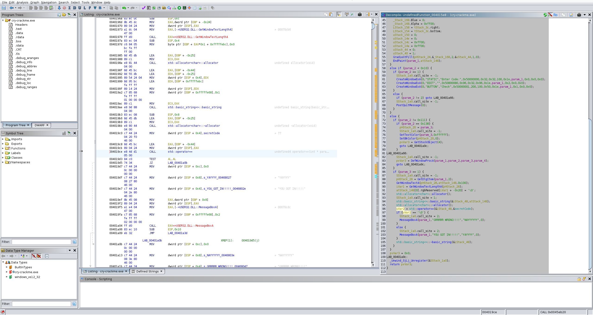
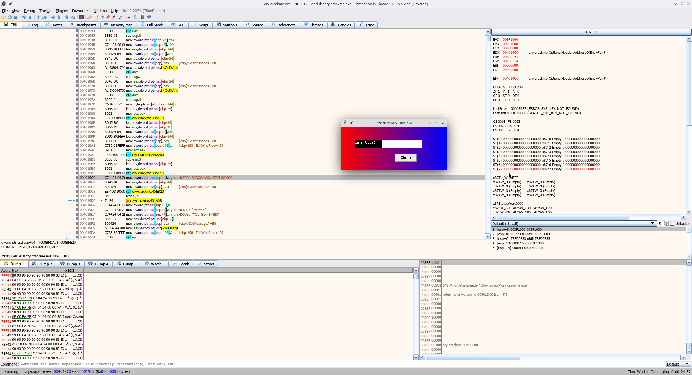
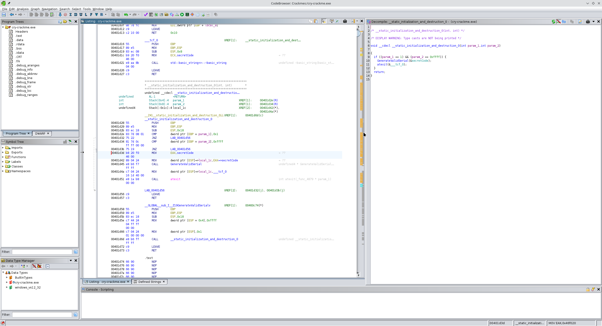

```
$ file cry-crackme.exe
cry-crackme.exe: PE32 executable (GUI) Intel 80386, for MS Windows, 15 sections
```

```
$ strings ./cry-crackme.exe | grep -v _ | grep -v \\. | grep -C10 GRR
=(!F
=8!F
Enter Code:
STATIC
EDIT
Check
BUTTON
YAYYYY
YOU GOT IN!!!!!
NAYYYYYY
GRRRRR WRONG!!!!
NOOOOOO!
WINDOW BAD!!!!
CrYP70NYM'S CRACKME
NOOOOO
WINDOW IS NOT BEING CREATED!
std::exception
init
pure virtual method called
deleted virtual method called
generic
```

* Defined Strings > `YOU GOT IN!!!!!` > Listing > XREF
* Function sets up the GUI and compares the user input to the variable `secretCode`

    

* Address of comparison: `004019ce`
* Try to determine key with x32dbg:

    

    

    * But key changes each time the crackme is executed

* Continue in Ghidra
* Double-click on `secretCode` > XREF in Listing to `__static_initialization_and_destruction_0()`

    

    ```c
    void __cdecl __static_initialization_and_destruction_0(int param_1,int param_2)

    {
    if ((param_1 == 1) && (param_2 == 0xffff)) {
        GenerateValidSerial(&secretCode);
        atexit(&___tcf_0);
    }
    return;
    }
    ```
* `GenerateValidSerial()`:
    ```c
    undefined4 * __cdecl GenerateValidSerial(undefined4 *secretCodeParam)

    {
    int random_int;
    time_t current_time;
    SjLj_Function_Context local_60;
    undefined *local_40;
    undefined *local_3c;
    undefined *local_38;
    char secret_code;
    int i;
    undefined local_1c [12];
    
    local_38 = &stack0xffffff84;
    local_60.personality = &___gxx_personality_sj0;
    local_60.lsda = &.gcc_except_table;
    local_40 = local_1c;
    local_3c = &LAB_004015af;
    _Unwind_SjLj_Register(&local_60);
    current_time = _time(0);
    _srand(current_time);
    local_60.call_site = -1;
    std::basic_string<>::basic_string(secretCodeParam);
    for (i = 0; i < 16; i += 1) {
        random_int = _rand();
        secret_code = random_int + (random_int / 26) * -26 + 'A';
        local_60.call_site = 1;
        std::basic_string<>::operator+=(secretCodeParam,secret_code);
    }
    _Unwind_SjLj_Unregister(&local_60);
    return secretCodeParam;
    }
    ```
* Since the secret code depends on the PRNG initialized with the current timestamp, a keygen is probably not possible
* One could could patch the call to `srand()` so the crackme always expects the same secret code or just skip the check altogether

