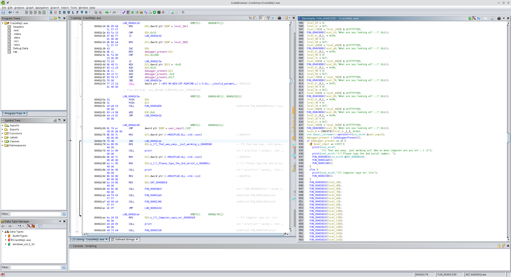

```
file CrackMeJ1.exe 
CrackMeJ1.exe: PE32 executable (console) Intel 80386, for MS Windows, 5 sections
```

# Serials:

## First serial

1) `1337`

Defined Strings:

`00406580	[*] That was easy, just warming out! Now on what computer are you on? ;-) 
	"[*] That was easy, just warming out! Now on what computer are you on? ;-) \n"	ds`




To debug it with x64dbg, the checks for a debugger first have to be patched out

```
        00402410 85 c0           TEST       debugger_present,debugger_present
        00402412 0f 84 51        JZ         LAB_00402c69
                 08 00 00

```

* JZ -> JMP
* Add two NOP instructions so we still use 6 bytes

```
        00402410 85 c0           TEST       debugger_present,debugger_present
        00402412 66 e9 53 08     JMP        LAB_00402c69
        00402416 90              NOP
        00402417 90              NOP
```

That didn't work
2nd try:

```
        00402410 85 c0           TEST       debugger_present,debugger_present
        00402412 0f 85 51        JNZ        LAB_00402c69
                 08 00 00
```

This worked as expected.

## Second serial

Defined Strings:

`00406244	[*] That was.. still easy! Now what's the last serial?
	"[*] That was.. still easy! Now what's the last serial?\n"	ds`

Rename variable so I know which variable contains the serial:

```
    if (user_input == 1337) {
      print(cout_exref,
            "[*] That was easy, just warming out! Now on what computer are you on? ;-) \n");
      print(cout_exref,"[!] Please type the 2nd serial number: ");
      FUN_00403810(cin_exref,&second_serial);
      FUN_004012a0();
      FUN_00401340();
    }
```


Backtracking from the check:

```
  if (uVar2 == 0) {
    print(cout_exref,"[*] That was.. still easy! Now what\'s the last serial?\n");
```

```
LAB_004013ef:
    uVar2 = 0;
```

```
LAB_004013bb:
    bVar3 = *second_serial_copy < *serial_3_cpy;
    if ((*second_serial_copy == *serial_3_cpy) &&
       ((uVar1 == 0xfffffffd ||
        ((bVar3 = *(second_serial_copy + 1) < *(serial_3_cpy + 1),
         *(second_serial_copy + 1) == *(serial_3_cpy + 1) &&
         ((uVar1 == 0xfffffffe ||
          ((bVar3 = *(second_serial_copy + 2) < *(serial_3_cpy + 2),
           *(second_serial_copy + 2) == *(serial_3_cpy + 2) &&
           ((uVar1 == 0xffffffff ||
            (bVar3 = *(second_serial_copy + 3) < *(serial_3_cpy + 3),
            *(second_serial_copy + 3) == *(serial_3_cpy + 3))))))))))))) goto LAB_004013ef;
```

```
  if (DAT_00408028 != DAT_00408488) goto LAB_004014e3;
```

```
        00401394 3b 35 88        CMP        ESI,dword ptr [DAT_00408488]
                 84 40 00
```

To find a byte pattern in x64dbg

`findallmem 0x0, 3b3588844000`

