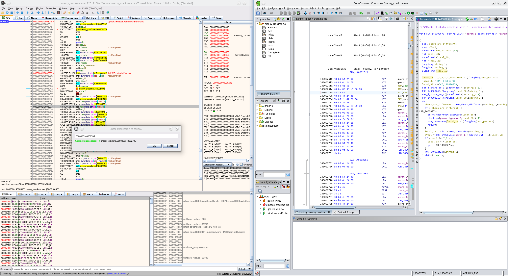

```
file messy_crackme.exe
messy_crackme.exe: PE32+ executable (console) x86-64, for MS Windows, 6 sections
```

* Try `strings messy_crackme.exe`:
    ```
    [...]
    {hidden}
    admin
    GUEST
    guest
    aname
    admin
    guest
    46cda556dda9a8d7f57009244
    0c90182b4de6d21cfca38a4ec
    hello 
    989576b5cfaa06654217d7a1a
    type userid: 
    type userpw for user 
    incorrect user!
    [...]
    ```
* [Go to virtual address in x64dbg with <kbd>Ctrl</kbd>+<kbd>G</kbd>](https://reverseengineering.stackexchange.com/questions/30250/how-to-navigate-disassembly-view-to-specific-absolute-address-location)

